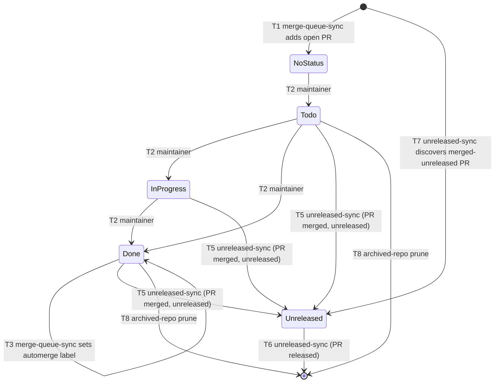

# Board-Statusübergänge

Status: draft

## Kontext
Das Merge-Queue-Board (Projects-V2-Board #5) führt jeden in Arbeit befindlichen
Pull Request des `nolte/*`-Portfolios durch einen Lebenszyklus, von „gerade
geöffnet" bis „in einem Release ausgeliefert". Dieser Lebenszyklus wird von drei
Automatisierungen plus dem Drag-and-drop des Maintainers getrieben, und jede
Stufe ist ein Wert des Single-Select-Feldes `Status`. Zwei Schwester-Specs
definieren bereits die *Mechanik* der beiden Automatisierungen —
[`merge-queue-automation`](../merge-queue-automation/de.md) (offene PRs,
`Done` → `automerge`) und [`unreleased-changes`](../unreleased-changes/de.md)
(Erkennung merged-but-unreleased) — aber keine benennt den **Zustandsautomaten**,
durch den die Karte wandert: welche Übergänge es gibt, wer jeden auslöst, unter
welcher Vorbedingung, mit welchem Effekt und welcher Latenz. Ohne das sind die
beiden Automatisierungen und der Mensch drei Akteure, die dasselbe Feld ohne
schriftlichen Kontrakt mutieren, und eine „hängende" Karte (ein gemergter PR noch
in `Done`, ein released PR noch in `Unreleased`) liest sich als Bug ohne Spec zum
Abgleich.

Diese Spec ist dieser Kontrakt. Sie zählt die `Status`-Werte auf, jeden legalen
Übergang zwischen ihnen, Akteur und Auslöser jedes Übergangs sowie die
Invarianten, die nach der Abgleichung gelten müssen. Sie regelt die **Übergänge**,
nicht die Erkennungs- oder Labeling-Interna, die diese Übergänge aufrufen (die
bleiben in den Schwester-Specs).

## Ziele
- Den vollen Karten-Lebenszyklus des Boards explizit machen: jeden `Status`-Wert
  und jeden legalen Übergang zwischen ihnen, an einer Stelle
- Akteur (Maintainer, `merge-queue-sync`, der Automerge-Workflow des Ziel-Repos,
  `unreleased-sync`), Auslöser, Vorbedingung, Effekt und Latenz jedes Übergangs
  benennen
- Die Invarianten benennen, die nach jedem Abgleich-Zyklus gelten, sodass eine
  „hängende" Karte gegen eine schriftliche Regel prüfbar ist statt geraten
- Die Schreib-Verantwortlichkeiten der drei Akteure auf dem `Status`-Feld
  disjunkt und konfliktfrei halten

## Nicht-Ziele
- Die Erkennungs- und Labeling-Interna, die jeder Übergang aufruft — gehören zu
  [`merge-queue-automation`](../merge-queue-automation/de.md) (Board-Befüllung,
  `Done` → `automerge`, Archiv-Prune) und
  [`unreleased-changes`](../unreleased-changes/de.md) (Erkennung
  merged-but-unreleased)
- Die Felder, Views und das Audience-Modell des Boards — gehören zu
  [`portfolio-board`](../portfolio-board/de.md) und
  [`portfolio-views`](../portfolio-views/de.md)
- Release-Versionierung und der Publish-Flow — gehören zu den Specs
  `release-automation` und `branching-model`
- Bereitstellung von Tokens oder Variablen — gehört zu Terraform in
  `terraform-github-bootstrap`

## Anforderungen

### Status-Werte
- Das Single-Select-Feld `Status` **MUSS** genau diese Werte in dieser
  Spaltenreihenfolge tragen:
  - **No Status** — ein transienter Zustand: Das Item wurde gerade hinzugefügt
    und wartet auf Triage. Keine konfigurierte Option, sondern die Abwesenheit
    eines `Status`-Werts
  - **Todo** — ein offener Pull Request, triagiert, noch nicht begonnen
  - **In Progress** — ein offener Pull Request, in aktiver Arbeit
  - **Done** — ein offener Pull Request, vom Maintainer als auslieferungsbereit
    markiert
  - **Unreleased** — ein gemergter Pull Request, noch nicht Teil eines
    veröffentlichten Releases
- Ein Item, das das Board verlässt (gelöscht), ist der terminale Zustand
  **off-board** und ist kein `Status`-Wert
- Offene Pull Requests **MÜSSEN** nur `{No Status, Todo, In Progress, Done}`
  einnehmen; gemergte Pull Requests **MÜSSEN** nur `{Unreleased}` einnehmen. Nach
  einem vollen Abgleich-Zyklus **DÜRFEN** sich die beiden Mengen **NICHT**
  überschneiden

### Übergangs-Katalog
Jeder legale Übergang ist eine Zeile unten. Kein Übergang außerhalb dieses
Katalogs wird von einer Automatisierung geschrieben; die manuellen Drags des
Maintainers beschränken sich auf T2.

| # | Von | Nach | Auslöser | Akteur | Vorbedingung | Effekt |
|---|---|---|---|---|---|---|
| T1 | off-board | No Status | ein offener `nolte/*`-PR existiert | `merge-queue-sync` (cron `*/10`) | PR offen, Repo nicht archiviert | Item zum Board hinzugefügt (kein `Status`) |
| T2 | No Status / Todo / In Progress / Done | Todo / In Progress / Done | manueller Drag | Maintainer | Item vorhanden, PR offen | `Status` auf die Zielspalte gesetzt |
| T3 | Done | Done **+ `automerge`-Label** | `Status == Done` und PR offen | `merge-queue-sync` (cron `*/10`) | `automerge`-Label existiert im Ziel-Repo | Label via REST-Issues-Endpoint gesetzt (kein `Status`-Wechsel) |
| T4 | (Done, gelabelt) | PR gemergt | erforderliche Checks grün | Automerge-Workflow des Ziel-Repos (gh-plumbing) | `automerge`-Label vorhanden | PR squash-gemergt; PR-State `OPEN → MERGED` (Karte bleibt in `Done`) |
| T5 | Todo / In Progress / Done | Unreleased | PR ist gemergt **und** unreleased | `unreleased-sync` (cron stündlich) Phase A | `merge_commit_sha` nicht vom letzten published Release-Tag erreichbar, oder Repo hat kein Release | `Status` auf `Unreleased` gesetzt |
| T6 | Unreleased | off-board | PR ist released | `unreleased-sync` (cron stündlich) Phase A | `merge_commit_sha` vom letzten published Release-Tag erreichbar | Item vom Board gelöscht |
| T7 | off-board | Unreleased | ein merged-but-unreleased PR wird entdeckt, der noch kein Board-Item ist | `unreleased-sync` (cron stündlich) Phase B | Release-Repo; Merge-Commit im `baseline...tip`-Compare-Range; noch nicht auf dem Board | Item hinzugefügt und `Status` auf `Unreleased` gesetzt |
| T8 | beliebig | off-board | das Repository des PRs ist archiviert | `merge-queue-sync` (cron `*/10`) | `repository.isArchived == true` | Item vom Board gelöscht |
| T9 | gemergt / geschlossen | off active board (archiviertes Item) | Built-in-Workflow **Auto-archive items**, falls aktiviert | Projects-Built-in-Workflow | Item passt zum Archiv-Filter **und** `Status != Unreleased` | Item vom aktiven Board archiviert |

- Jeder automatisierte Übergang (T1, T3, T5–T8) **MUSS** idempotent sein: Erneutes
  Ausführen auf einem Item, das bereits im Zielzustand ist, ist ein No-op
- T3 **MUSS** das `automerge`-Label höchstens einmal pro Pull Request vergeben und
  nur, solange der PR offen und in `Done` ist; das Label wird via REST-Issues-Endpoint
  gesetzt, nie via `gh pr edit` (siehe
  [`merge-queue-automation`](../merge-queue-automation/de.md))
- T5 **MUSS** einen gemergten PR in einem Repository ohne published Release als
  unreleased behandeln, sodass eine gemergte Karte immer `Unreleased` erreicht
  statt zu stranden
- T6 **MUSS** einen released Pull Request vom Board entfernen, statt ihn in
  `Unreleased` zu belassen; die released-Bestimmung gehört zu
  [`unreleased-changes`](../unreleased-changes/de.md)
- T9 **MUSS** `Status == Unreleased` aus dem Auto-archive-Filter ausschließen,
  sonst würde der Built-in die (gemergten) `Unreleased`-Karten archivieren, die T5
  gerade gesetzt hat

### Zustandsdiagramm

### Akteure und Verantwortlichkeit
- Der **Maintainer** besitzt nur T2 — die manuellen Triage-Drags über die
  Offen-PR-Spalten. Keine Automatisierung schreibt T2-Übergänge
- **`merge-queue-sync`** besitzt T1, T3 und T8 — Board-Befüllung, das
  `Done` → `automerge`-Label und den Archiv-Repo-Prune. Es **DARF NICHT**
  `Unreleased` schreiben
- Der **Automerge-Workflow des Ziel-Repos** besitzt T4 — den eigentlichen Merge.
  Er rührt dieses Board nicht an; der Merge wird von `unreleased-sync` beobachtet
- **`unreleased-sync`** besitzt T5, T6 und T7 — die Post-Merge-Übergänge in und
  aus `Unreleased`. Es **DARF NICHT** offene Pull Requests bewegen
- Der Built-in-**Auto-archive**-Workflow besitzt T9, falls aktiviert, unter der
  obigen `Unreleased`-Ausnahme
- Die Schreib-Verantwortlichkeiten der drei Automatisierungen auf `Status`
  **MÜSSEN** gemäß obiger Zuständigkeit disjunkt bleiben, sodass keine zwei
  Akteure um den Zustand desselben Items konkurrieren

### Invarianten (gelten nach einem vollen Abgleich-Zyklus)
- **I1** — kein gemergter Pull Request bleibt über einen `unreleased-sync`-Zyklus
  hinaus in `Todo`, `In Progress` oder `Done`; er ist in `Unreleased` oder
  off-board
- **I2** — kein released Pull Request bleibt in `Unreleased`; er ist off-board
- **I3** — jedes `Unreleased`-Item ist ein gemergter Pull Request, dessen
  Merge-Commit nicht vom letzten published Release-Tag seines Repositories
  erreichbar ist
- **I4** — kein Board-Item gehört zu einem archivierten Repository
- **I5** — das `automerge`-Label ist nur an Pull Requests vorhanden, die offen in
  `Done` waren

### Latenz
- T2 (manuell) ist sofort
- T3 greift binnen etwa eines `merge-queue-sync`-Intervalls (`*/10`, plus GitHubs
  Scheduled-Run-Jitter); T4 folgt, sobald die erforderlichen Checks grün sind
- T5, T6, T7 greifen binnen etwa eines `unreleased-sync`-Intervalls (stündlich)
- Das Board ist daher **letztlich konsistent**, nicht echtzeitig; eine Karte kann
  ein Intervall hinter dem zugrunde liegenden Pull-Request-Zustand liegen. Diese
  Latenz **MUSS** als erwartet behandelt werden, nicht als Defekt

## Akzeptanzkriterien
- [ ] Das `Status`-Feld trägt genau `Todo`, `In Progress`, `Done`, `Unreleased` (plus transientes No Status), in dieser Spaltenreihenfolge
- [ ] Jeder Übergang, der auf dem Board geschieht, ist einer von T1–T9; keine Automatisierung schreibt einen Übergang außerhalb des Katalogs
- [ ] T2 (manuelle Triage-Drags) ist der einzige vom Maintainer getriebene Übergang; alle anderen sind automatisiert und idempotent
- [ ] `merge-queue-sync` schreibt nur T1, T3, T8 und setzt nie `Unreleased`; `unreleased-sync` schreibt nur T5–T7 und bewegt nie offene Pull Requests
- [ ] Ein gemergter Pull Request erreicht `Unreleased` auch dann, wenn sein Repository kein published Release hat (T5), und ein released Pull Request verlässt das Board (T6)
- [ ] Die Invarianten I1–I5 gelten nach einem vollen Abgleich-Zyklus
- [ ] Falls der Auto-archive-Built-in aktiviert ist, schließt sein Filter `Status == Unreleased` aus (T9)
- [ ] Das Board ist als letztlich konsistent mit den angegebenen Pro-Übergang-Latenzen dokumentiert

## Offene Fragen
- Soll T5 (Done → Unreleased) zusätzlich im häufigeren `merge-queue-sync`
  (`*/10`) als optimistischer Move laufen, sodass eine gemergte Karte `Unreleased`
  in Minuten statt binnen einer Stunde erreicht — auf Kosten einer verwischten
  Akteur-Zuständigkeitsgrenze?
- Soll ein **ohne Merge geschlossener** Pull Request einen expliziten Übergang
  bekommen (heute wird er nur von Auto-archive entfernt, falls aktiviert), oder
  ist stilles Entfernen akzeptabel?
- Soll `No Status` zu einer expliziten `Triage`-Spalte (eine echte Option)
  befördert werden, sodass neu hinzugefügte Items als Spalte sichtbar sind statt
  im impliziten No-Status-Eimer?

## Referenzen
- [`merge-queue-automation`](../merge-queue-automation/de.md) — Interna von T1, T3, T8
- [`unreleased-changes`](../unreleased-changes/de.md) — Interna von T5, T6, T7 und die released-Baseline-Bestimmung
- [`portfolio-board`](../portfolio-board/de.md) — das `Status`-Feld und Board-Modell
- [`portfolio-views`](../portfolio-views/de.md) — die Views, die diese Status lesen
- `branching-model` / `release-automation` — der Publish-Flow, der T6 auslöst
