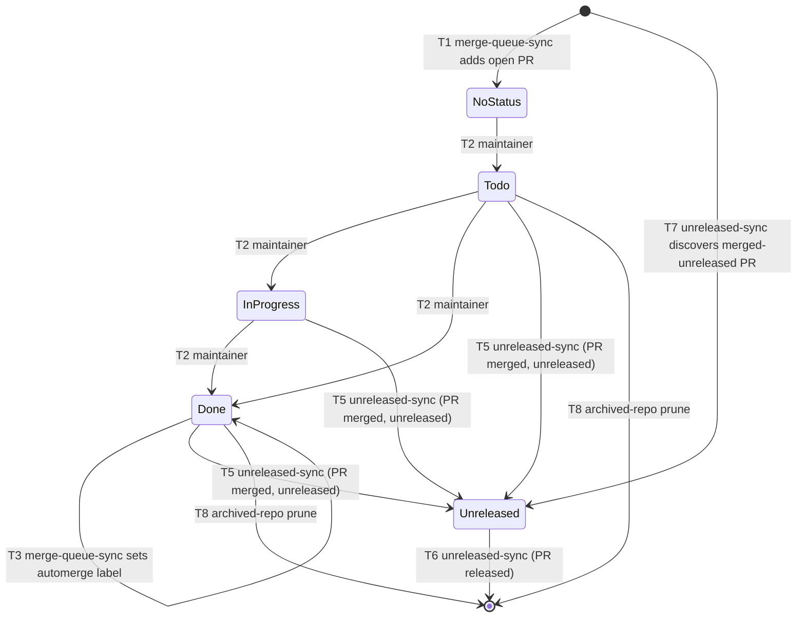

# Board Status Transitions

Status: draft

## Context
The merge-queue board (Projects V2 board #5) carries every in-flight pull request
of the `nolte/*` portfolio through a lifecycle, from "just opened" to "shipped in
a release". That lifecycle is driven by three automations plus the maintainer's
own drag-and-drop, and each stage is a value of the board's single-select
`Status` field. Two sibling specs already define the *mechanics* of the two
automations — [`merge-queue-automation`](../merge-queue-automation/en.md) (open
PRs, `Done` → `automerge`) and [`unreleased-changes`](../unreleased-changes/en.md)
(merged-but-unreleased detection) — but nothing states the **state machine** the
card moves through: which transitions exist, who triggers each, under what
precondition, with what effect and latency. Without that, the two automations and
the human are three actors mutating the same field with no written contract, and
a card that gets "stuck" (a merged PR still in `Done`, a released PR still in
`Unreleased`) reads as a bug with no spec to check against.

This spec is that contract. It enumerates the `Status` values, every legal
transition between them, the actor and trigger of each, and the invariants that
must hold after reconciliation. It governs the **transitions**, not the detection
or labeling internals those transitions invoke (those stay in the sibling specs).

## Goals
- Make the board's full card lifecycle explicit: every `Status` value and every
  legal transition between them, in one place
- Name the actor (maintainer, `merge-queue-sync`, the target repo's automerge
  workflow, `unreleased-sync`), trigger, precondition, effect, and latency of
  each transition
- State the invariants that hold after each reconciliation cycle, so a "stuck"
  card is checkable against a written rule rather than guessed at
- Keep the three actors' write responsibilities on the `Status` field disjoint
  and non-conflicting

## Non-Goals
- The detection and labeling internals each transition invokes — owned by
  [`merge-queue-automation`](../merge-queue-automation/en.md) (board population,
  `Done` → `automerge`, archived prune) and
  [`unreleased-changes`](../unreleased-changes/en.md) (merged-but-unreleased
  detection)
- The board's fields, views, and audience model — owned by
  [`portfolio-board`](../portfolio-board/en.md) and
  [`portfolio-views`](../portfolio-views/en.md)
- Release versioning and the publish flow — owned by the `release-automation` and
  `branching-model` specs
- Provisioning of tokens or variables — owned by Terraform in
  `terraform-github-bootstrap`

## Requirements

### Status values
- The `Status` single-select field **MUST** carry exactly these values, in this
  column order:
  - **No Status** — a transient state: the item was just added and awaits triage.
    Not a configured option; it is the absence of a `Status` value
  - **Todo** — an open pull request, triaged, not yet started
  - **In Progress** — an open pull request, actively being worked
  - **Done** — an open pull request the maintainer has marked ready to ship
  - **Unreleased** — a merged pull request not yet part of a published release
- An item that leaves the board (deleted) is the terminal **off-board** state and
  is not a `Status` value
- Open pull requests **MUST** occupy only `{No Status, Todo, In Progress, Done}`;
  merged pull requests **MUST** occupy only `{Unreleased}`. After a full
  reconciliation cycle the two sets **MUST NOT** overlap

### Transition catalogue
Every legal transition is one row below. No transition outside this catalogue is
written by any automation; the maintainer's manual drags are confined to T2.

| # | From | To | Trigger | Actor | Precondition | Effect |
|---|---|---|---|---|---|---|
| T1 | off-board | No Status | an open `nolte/*` PR exists | `merge-queue-sync` (cron `*/10`) | PR open, repo not archived | item added to the board (no `Status`) |
| T2 | No Status / Todo / In Progress / Done | Todo / In Progress / Done | manual drag | maintainer | item present, PR open | `Status` set to the target column |
| T3 | Done | Done **+ `automerge` label** | `Status == Done` and PR open | `merge-queue-sync` (cron `*/10`) | `automerge` label exists in the target repo | label applied via the REST issues endpoint (no `Status` change) |
| T4 | (Done, labelled) | PR merged | required checks green | target repo's gh-plumbing automerge workflow | `automerge` label present | PR squash-merged; PR state `OPEN → MERGED` (card stays in `Done`) |
| T5 | Todo / In Progress / Done | Unreleased | PR is merged **and** unreleased | `unreleased-sync` (cron hourly) Phase A | `merge_commit_sha` not reachable from the latest published release tag, or the repo has no published release | `Status` set to `Unreleased` |
| T6 | Unreleased | off-board | PR is released | `unreleased-sync` (cron hourly) Phase A | `merge_commit_sha` reachable from the latest published release tag | item deleted from the board |
| T7 | off-board | Unreleased | a merged-but-unreleased PR is discovered that is not yet a board item | `unreleased-sync` (cron hourly) Phase B | release repo; merge commit in the `baseline...tip` compare range; not already on the board | item added and `Status` set to `Unreleased` |
| T8 | any | off-board | the PR's repository is archived | `merge-queue-sync` (cron `*/10`) | `repository.isArchived == true` | item deleted from the board |
| T9 | merged / closed | off active board (archived item) | the built-in **Auto-archive items** workflow, when enabled | Projects built-in workflow | item matches the archive filter **and** `Status != Unreleased` | item archived off the active board |

- Every automated transition (T1, T3, T5–T8) **MUST** be idempotent: re-running it
  on an item already in the target state is a no-op
- T3 **MUST** apply the `automerge` label at most once per pull request and only
  while the PR is open and in `Done`; the label is set via the REST issues
  endpoint, never `gh pr edit` (see
  [`merge-queue-automation`](../merge-queue-automation/en.md))
- T5 **MUST** treat a merged PR in a repository with no published release as
  unreleased, so a merged card always reaches `Unreleased` rather than being
  stranded
- T6 **MUST** remove a released pull request from the board rather than leaving it
  in `Unreleased`; the released determination is owned by
  [`unreleased-changes`](../unreleased-changes/en.md)
- T9 **MUST** exclude `Status == Unreleased` from the Auto-archive filter, or the
  built-in would archive the (merged) `Unreleased` cards that T5 just placed

### State diagram

### Actors and ownership
- The **maintainer** owns T2 only — the manual triage drags across the open-PR
  columns. No automation writes T2's transitions
- **`merge-queue-sync`** owns T1, T3, and T8 — board population, the
  `Done` → `automerge` label, and the archived-repo prune. It **MUST NOT** write
  `Unreleased`
- The **target repository's automerge workflow** owns T4 — the actual merge. It
  does not touch this board; the merge is observed by `unreleased-sync`
- **`unreleased-sync`** owns T5, T6, and T7 — the post-merge transitions into and
  out of `Unreleased`. It **MUST NOT** move open pull requests
- The built-in **Auto-archive** workflow owns T9 when enabled, under the
  `Unreleased` exclusion above
- The three automations' write responsibilities on `Status` **MUST** stay
  disjoint per the ownership above, so no two actors contend for the same item's
  state

### Invariants (hold after a full reconciliation cycle)
- **I1** — no merged pull request remains in `Todo`, `In Progress`, or `Done`
  beyond one `unreleased-sync` cycle; it is in `Unreleased` or off-board
- **I2** — no released pull request remains in `Unreleased`; it is off-board
- **I3** — every `Unreleased` item is a merged pull request whose merge commit is
  not reachable from its repository's latest published release tag
- **I4** — no board item belongs to an archived repository
- **I5** — the `automerge` label is present only on pull requests that were in
  `Done` while open

### Latency
- T2 (manual) is immediate
- T3 lands within roughly one `merge-queue-sync` interval (`*/10`, plus GitHub's
  scheduled-run jitter); T4 follows once required checks pass
- T5, T6, T7 land within roughly one `unreleased-sync` interval (hourly)
- The board is therefore **eventually consistent**, not real-time; a card may sit
  one interval behind the underlying pull-request state. This latency **MUST** be
  treated as expected, not a defect

## Acceptance Criteria
- [ ] The `Status` field carries exactly `Todo`, `In Progress`, `Done`, `Unreleased` (plus transient No Status), in that column order
- [ ] Every transition that occurs on the board is one of T1–T9; no automation writes a transition outside the catalogue
- [ ] T2 (manual triage drags) is the only maintainer-driven transition; all others are automated and idempotent
- [ ] `merge-queue-sync` writes only T1, T3, T8 and never sets `Unreleased`; `unreleased-sync` writes only T5–T7 and never moves open pull requests
- [ ] A merged pull request reaches `Unreleased` even when its repository has no published release (T5), and a released pull request leaves the board (T6)
- [ ] Invariants I1–I5 hold after a full reconciliation cycle
- [ ] If the Auto-archive built-in is enabled, its filter excludes `Status == Unreleased` (T9)
- [ ] The board is documented as eventually consistent with the stated per-transition latencies

## Open Questions
- Should T5 (Done → Unreleased) also run inside the more frequent
  `merge-queue-sync` (`*/10`) as an optimistic move, so a merged card reaches
  `Unreleased` in minutes rather than within the hour — at the cost of blurring
  the actor-ownership boundary?
- Should a pull request **closed without merging** get an explicit transition
  (today it is only removed by Auto-archive, if enabled), or is silent removal
  acceptable?
- Should `No Status` be promoted to an explicit `Triage` column (a real option)
  so newly-added items are visible as a column rather than the implicit
  no-status bucket?

## References
- [`merge-queue-automation`](../merge-queue-automation/en.md) — T1, T3, T8 internals
- [`unreleased-changes`](../unreleased-changes/en.md) — T5, T6, T7 internals and the released-baseline determination
- [`portfolio-board`](../portfolio-board/en.md) — the `Status` field and board model
- [`portfolio-views`](../portfolio-views/en.md) — the views that read these statuses
- `branching-model` / `release-automation` — the publish flow that makes T6 fire
